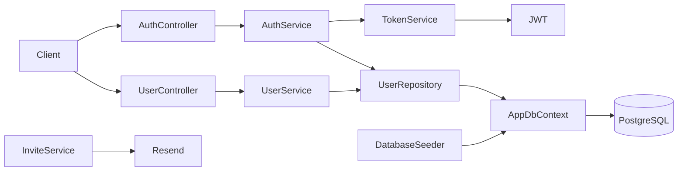

# Arquitetura

## Estilo atual

Monólito modular ASP.NET Core em um único projeto Web. A organização por funcionalidade mantém `Authentication` e `Users` em módulos, enquanto infraestrutura transversal fica em `Shared`.

## Camadas e dependências

| Área | Responsabilidade | Dependências principais |
|---|---|---|
| Controllers | HTTP, autorização e logging de falhas | Serviços por interface |
| Services | Orquestração de autenticação e usuários | Repositórios, token/configuração |
| Repositories | Consulta e persistência de usuários | `AppDbContext` |
| Shared/Database | EF Core, schema e seed | Npgsql/PostgreSQL |

`Program.cs` compõe o host: controllers, Swagger, DbContext Npgsql, Resend, JWT, serviços do módulo e seed. O middleware executa HTTPS, autenticação, autorização e mapeamento de controllers.

## Banco

As migrations criam `Users` e `Invites`. `User` possui identificador GUID, nome, e-mail, papel, hash de senha e flag de ativo. `Invite` registra e-mail ou telefone, papel, token, expiração e aceite.

## Ausências confirmadas

Não há worker, mensageria, cache, CI/CD, testes automatizados ou observabilidade além dos logs padrão e logs explícitos nos controllers.
