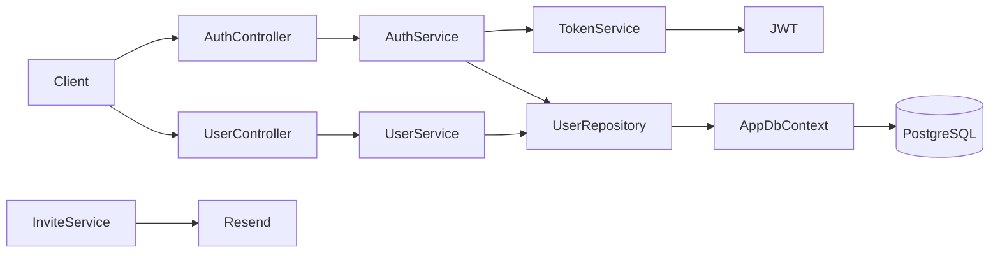

# PowerGrind

> Plataforma em desenvolvimento para gestão de academias de luta.

O **PowerGrind** é uma Web API .NET que, no estágio atual, fornece a fundação de autenticação, administração de usuários e convites. A visão do produto é evoluir para um SaaS em que academias administram alunos, instrutores, treinos, evolução e check-ins.

> **Estado do projeto:** a base de usuários e autenticação está implementada; academia, alunos, agenda de treinos, check-ins, relatórios e integrações esportivas ainda são planejados.

## Capacidades atuais

- Login por e-mail e senha com hash BCrypt.
- Emissão de JWT Bearer com claims de identificador, e-mail e papel.
- Operações administrativas de listagem, consulta, criação e atualização de usuários, protegidas pelo papel `Admin`.
- Persistência de usuários e convites com Entity Framework Core e PostgreSQL.
- Migrations para `Users` e `Invites`.
- Seed de um usuário administrador pela configuração.
- Serviço de criação e envio de convite por e-mail usando Resend.
- Ambiente local de PostgreSQL via Docker Compose.

## Visão do produto

O produto pretende atender academias de luta com:

- cadastro de academias, alunos e instrutores;
- convite por e-mail para o aluno concluir o cadastro;
- agenda de treinos por modalidade, com descrição elaborada pelo treinador;
- acompanhamento de peso, altura, anotações e evolução do aluno;
- observações do treinador no perfil do aluno;
- board e filtros de check-ins;
- relatórios e gráficos; recursos assistidos por IA e integrações Wellhub/TotalPass são possibilidades futuras.

A visão completa, as hipóteses e os limites estão em [.ai/context/product_vision.md](.ai/context/product_vision.md).

## Arquitetura

A aplicação é um monólito modular ASP.NET Core organizado por funcionalidade.



| Área | Responsabilidade |
|---|---|
| `Modules/Authentication` | Login, validação de senha e emissão de token |
| `Modules/Users` | Usuários, contratos HTTP, serviço, repositório e convites |
| `Shared/Database` | `AppDbContext`, migrations e seed de administrador |
| `Shared/Extensions` | Registro de serviços no contêiner de DI |

## Tecnologias

- .NET 10 / ASP.NET Core Web API
- Entity Framework Core 10
- PostgreSQL 16 / Npgsql
- JWT Bearer
- BCrypt.Net
- Resend
- Swagger / OpenAPI em Development
- Docker Compose

## Executar localmente

### Pré-requisitos

- .NET SDK 10
- Docker Desktop ou PostgreSQL 16 acessível localmente
- `dotnet-ef` para aplicar migrations

### 1. Inicie o PostgreSQL

```bash
docker compose up -d
```

O compose local expõe o PostgreSQL em `localhost:5432` e usa o banco `powergrind`.

### 2. Configure segredos de desenvolvimento

A API precisa de uma chave JWT. Para usar envio de convites, configure também a chave do Resend.

```bash
dotnet user-secrets set "Jwt:SecretKey" "uma-chave-local-segura"
dotnet user-secrets set "Resend:ApiKey" "sua-chave-do-resend"
```

Nunca versione chaves reais. As configurações presentes em `appsettings.json` são adequadas apenas para desenvolvimento local e devem ser substituídas em qualquer ambiente compartilhado.

### 3. Aplique as migrations

```bash
dotnet ef database update
```

### 4. Execute a API

```bash
dotnet run
```

Em ambiente `Development`, o Swagger fica disponível na URL exibida pelo host.

## Segurança e limitações atuais

- O seed cria um administrador com valores configurados em `Seed:*`; altere-os fora do código versionado.
- `Jwt:SecretKey` é obrigatório, mas não fica no arquivo de configuração versionado.
- `InviteService` envia e-mails, porém ainda não está registrado no DI nem exposto por endpoint HTTP.
- `CompleteInviteAsync` ainda não implementa validação do token, expiração ou conclusão do cadastro.
- `UserResponse` está vazio e alguns endpoints trabalham com a entidade de persistência; respostas futuras não devem expor `PasswordHash`.
- Não há testes automatizados, CI/CD, health checks ou tratamento global de exceções neste momento.

## Roadmap resumido

1. Concluir o fluxo de convite e contratos/validações de usuários.
2. Modelar academia, aluno, instrutor e vínculo por modalidade.
3. Entregar agenda de treinos, evolução e observações com autorização adequada.
4. Implementar check-ins e avaliar integrações externas.
5. Adicionar testes, observabilidade, pipeline e integração com o contexto `PowerGrind.FightEvents`.

## Documentação para colaboradores e agentes

A pasta [`.ai`](.ai/) é a fonte de contexto operacional do projeto:

- [estado atual](.ai/context/current_state.md)
- [arquitetura](.ai/architecture/architecture.md)
- [roadmap](.ai/context/roadmap.md)
- [backlog](.ai/kanban/backlog.md)
- [ADRs](.ai/architecture/adrs/)

Antes de propor ou implementar mudança relevante, leia essa documentação e trate o código como fonte de verdade.

## Licença

Nenhuma licença foi definida neste repositório.
